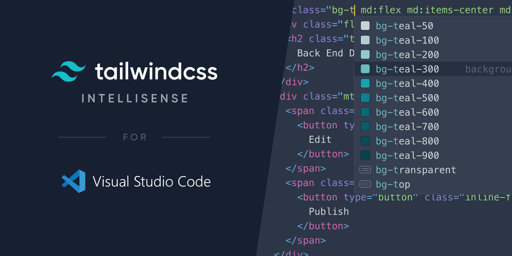

# **tailwindcss**



引入 **tailwindcss** 的目的是减少编写 css 。

## [间距](https://www.tailwindcss.cn/docs/customizing-spacing#-2)

默认情况下，Tailwind 包括一个丰富和全面的数字间隔比例。这些值是成比例的，所以 16 是 8 的两倍。一个间距单位等于 0.25rem，在通用浏览器中默认为 4px。

会应用 `padding`/`margin`/`top`/`left`/`right`/`bottom`/`width`/`height`/`lineHeight`/，`p-1 = padding: 4px;`/`p-1 = padding: 0.25rem;` 。

## 前缀

输入前缀会有代码提示，代码提示中包含具体内容。

|前缀|含义|
|----|----|
|`box-`|设置`box-sizing`|
|`float-`|设置浮动|
|`clear-`|清楚浮动|
|`object-`|用于控制可替换元素的内容如何调整大小及在其容器中的位置|
|`overflow-`|如何处理超出容器的内容`overflow`|
|`overscroll-`|用于控制浏览器到达滚动区域边界时的行为`overscroll-behavior`|
|`z-`|用于设置`z-index`|
|`flex`/`flex-`|flex布局|
|`justify-`|用于设置`justify-content`/`justify-items`/`justify-self`|
|`content-`|用于设置`align-content`|
|`items-`|用于设置`align-items`|
|`self-`|用于设置`align-self`|
|`grid-`|grid布局|
|`p-`|内边距`padding`|
|`m-`|外边距`margin`|
|`w-`|元素宽度`width`|
|`min-w-`|最小宽度`min-width`|
|`max-w-`|最小宽度`max-width`|
|`h-`|元素高度`height`|
|`min-h-`|最小高度`min-height`|
|`max-h-`|最小高度`max-height`|
|`text-`|字体大小、行高、对齐、颜色、透明度|
|`align-`|设置`vertical-align`|
|`whitespace-`|设置`white-space`|
|`break-`|文本换行|
|`placeholder-`|占位文本颜色及透明度|
|`list-`|列表项标记类型`list-style`|
|`bg-`|背景相关|
|`rounded-`|设置`border-radius`|
|`border-`|设置边框颜色、厚度、透明度、样式、表格边框|
|`divide-`|设置分割线颜色、厚度、透明度、样式|
|`ring-`|设置分割线颜色、厚度、透明度、偏移厚度、偏移颜色|
|`table-`|表格布局|
|`transition-`|过渡属性|
|`duration-`|过渡持续时间|
|`ease-`|过渡计时函数|
|`delay-`|过渡延迟|
|`animate-`|动画|
|`transform-`|变换|
|`origin-`|变换原点|
|`scale-`|缩放|
|`rotate-`|旋转|
|`translate-`|平移|
|`skew-`|倾斜|
|`pointer-`|指向事件`pointer-events`|
|`resize`/`resize-`|大小调整|
|`select-`|用户选择`user-select`|

## 特殊的，无共同前缀

### [Top / Right / Bottom / Left](https://www.tailwindcss.cn/docs/top-right-bottom-left)

使用 `{top|right|bottom|left|inset}-0` 功能类，将绝对定位的元素锚定在最近定位的父元素的任何边缘上。

### 定位

|Class|Properties|
|----|----|
|`static`|`position: static;`|
|`fixed`|`position: fixed;`|
|`absolute`|`position: absolute;`|
|`relative`|`position: relative;`|
|`sticky`|`position: sticky;`|

### 元素显示类型

|Class|Properties|
|----|----|
|`block`|`display: block;`|
|`inline-block`|`display: inline-block;`|
|`inline`|`display: inline;`|
|`flex`|`display: flex;`|
|`inline-flex`|`display: inline-flex;`|
|`table`|`display: table;`|
|`inline-table`|`display: inline-table;`|
|`table-caption`|`display: table-caption;`|
|`table-cell`|`display: table-cell;`|
|`table-column`|`display: table-column;`|
|`table-column-group`|`display: table-column-group;`|
|`table-footer-group`|`display: table-footer-group;`|
|`table-header-group`|`display: table-header-group;`|
|`table-row-group`|`display: table-row-group;`|
|`table-row`|`display: table-row;`|
|`flow-root`|`display: flow-root;`|
|`grid`|`display: grid;`|
|`inline-grid`|`display: inline-grid;`|
|`contents`|`display: contents;`|
|`list-item`|`display: list-item;`|
|`hidden`|`display: none;`|

### 文本装饰

|Class|Properties|
|----|----|
|`underline`|`text-decoration: underline;`|
|`line-through`|`text-decoration: line-through;`|
|`no-underline`|`text-decoration: none;`|

### 文本转换

|Class|Properties|
|----|----|
|`uppercase`|`text-transform: uppercase;`|
|`lowercase`|`text-transform: lowercase;`|
|`capitalize`|`text-transform: capitalize;`|
|`normal-case`|`text-transform: none;`|

### 文本溢出

|Class|Properties|
|----|----|
|`truncate`|`overflow: hidden;text-overflow: ellipsis;white-space: nowrap;`|
|`overflow-ellipsis`|`text-overflow: ellipsis;`|
|`overflow-clip`|`text-overflow: clip;`|

## [悬停、焦点和其它状态](https://www.tailwindcss.cn/docs/hover-focus-and-other-states)

下面列出几个常用的

### Hover

添加 `hover:` 前缀，以在 hover 状态时应用一个功能类。

``` html
<button class="bg-red-500 hover:bg-red-700 ...">
  Hover me
</button>
```

### Focus

添加 `focus:` 前缀，以在 focus 状态时应用一个功能类。

``` html
<input class="focus:ring-2 focus:ring-blue-600 ...">
```

### Active

添加 `active:` 前缀，以在元素处于 active 状态时应用某个功能。

``` html
<button class="bg-green-500 active:bg-green-700 ...">
  Click me
</button>
```

### Disabled

添加 `disabled:` 前缀，以便当一个元素被禁用时才应用功能类。

``` html
<button class="disabled:opacity-50 ..." disabled>
  Submit
</button>
```

### Visited

添加 `visited:` 前缀，以便当一个链接被访问后才应用功能类。

``` html
<a href="#" class="text-blue-600 visited:text-purple-600 ...">Link</a>
```

### First-child

添加 `first:` 前缀，以仅当元素是父元素的第一个子元素时才应用功能类。当使用某种循环生成元素时，最为有用。

``` html
<div v-for="item in items" class="transform first:rotate-45 ...">
  {{ item }}
</div>
```

### Last-child

添加 `last:` 前缀，在仅当元素是父元素的最后一个子元素时才应用功能类。当使用某种循环生成元素时，最为有用。

``` html
<div v-for="item in items" class="transform last:rotate-45 ...">
  {{ item }}
</div>
```

### Odd-child

添加 `odd:` 前缀使得仅在元素是父级奇数子元素的时候才应用功能类。当使用某种循环生成元素时，最为有用。

``` html
<div v-for="item in items" class="transform odd:rotate-45 ...">
  {{ item }}
</div>
```

### Even-child

添加 `even:` 前缀使得仅在元素是父级偶数子元素的时候才应用功能类。当使用某种循环生成元素时，最为有用。

``` html
<div v-for="item in items" class="transform even:rotate-45 ...">
  {{ item }}
</div>
```
